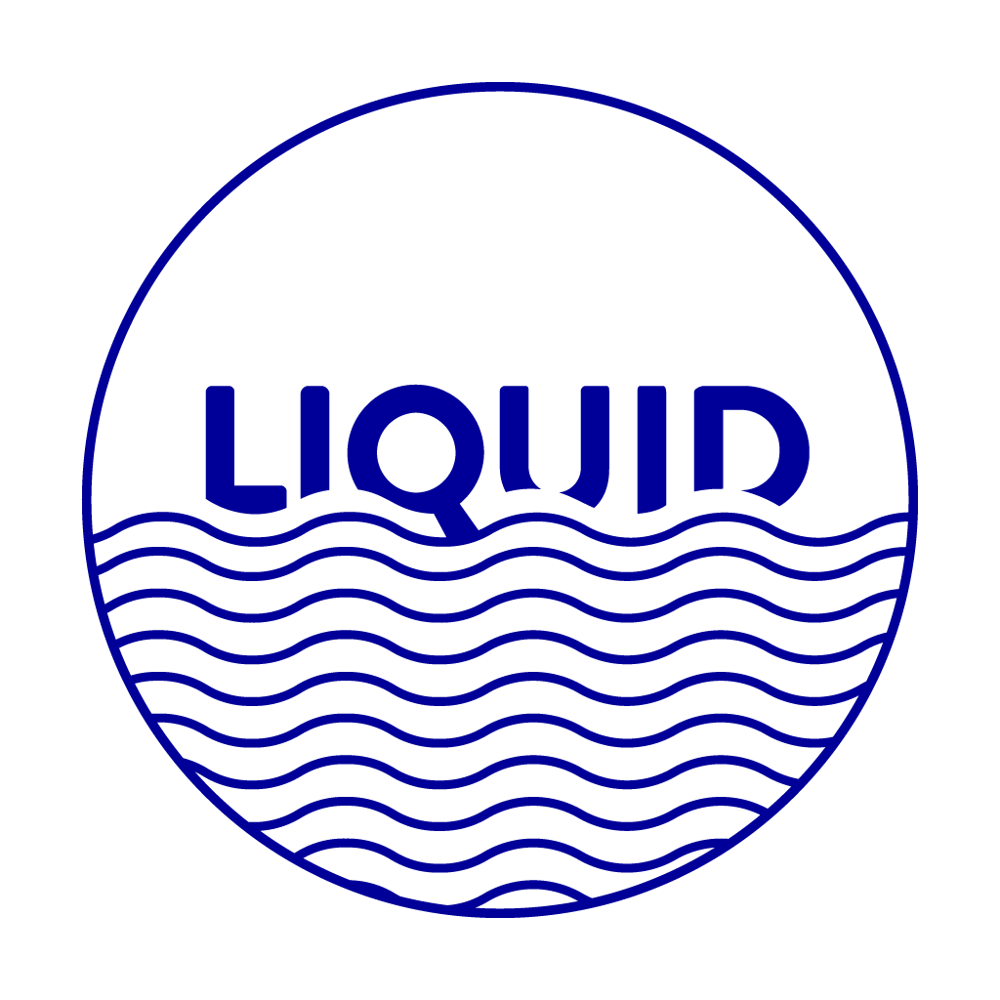

# Hi there, I'm Ayman Makhoukhi 👋

## I'm a MSc Computer Science Student, FullStack Developer, Data Analyst/Scientist and UI/UX Designer

- 🌱 I’m currently coding in Vue 3
- 👯 Thirsty for learning more about the CS industry
- 🥅 Goals: MSc Degree and Working with clients
- ⚡ Fun fact: Looking forward to become a business owner in the forthcoming years.

## Connect with me:

[][linkedin]
[][instagram]
[][dribbble]

<!-- [][website] -->

 

## Languages and Tools:  
- ### Frontend:

  

  

  

  

  

  
  

  

  

  

  

  

  

   

- ### Backend & Databases:

    

    

    

    

    

   

- ### Data Science :

  

  

  

  

  

  

  

  

- ### Other Programming Languages :

  
  

  

- ### Operating Systems:
  
  
  
    
  

    
- ### Tools
    
    
    
    
    
    
    
    
    
    
    
    
    
    
    

  
- ### Others
    
    
    
    

    

<!--
## Github Stats: 

-->

[website]: https://aymanmakhoukhi.netlify.app/
[instagram]: https://www.instagram.com/ayman_makhoukhi/
[linkedin]: https://www.linkedin.com/in/ayman-makhoukhi-81701a214/
[dribbble]: https://dribbble.com/AymanMak
